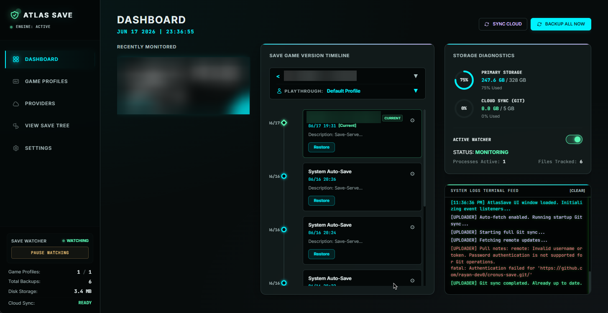
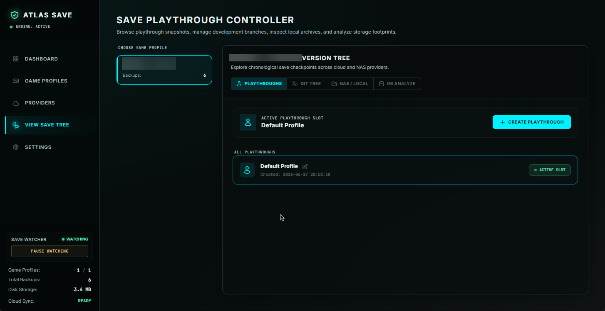
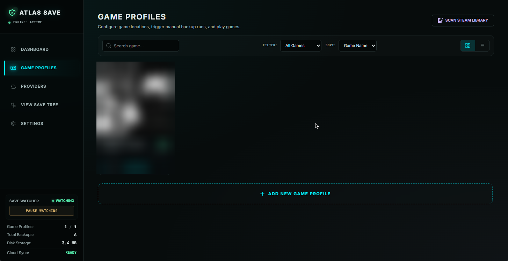
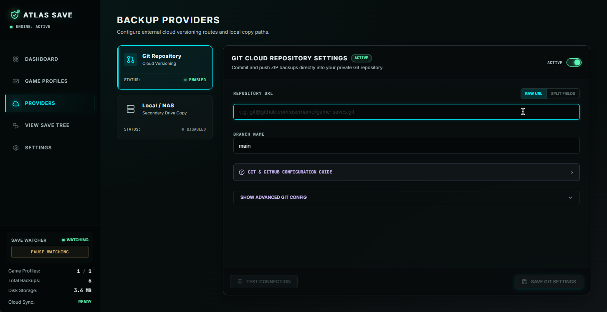
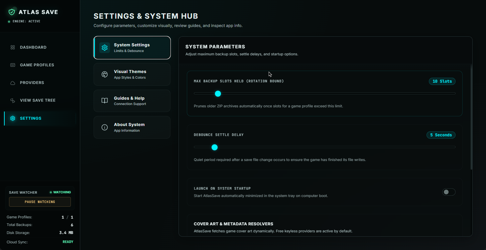
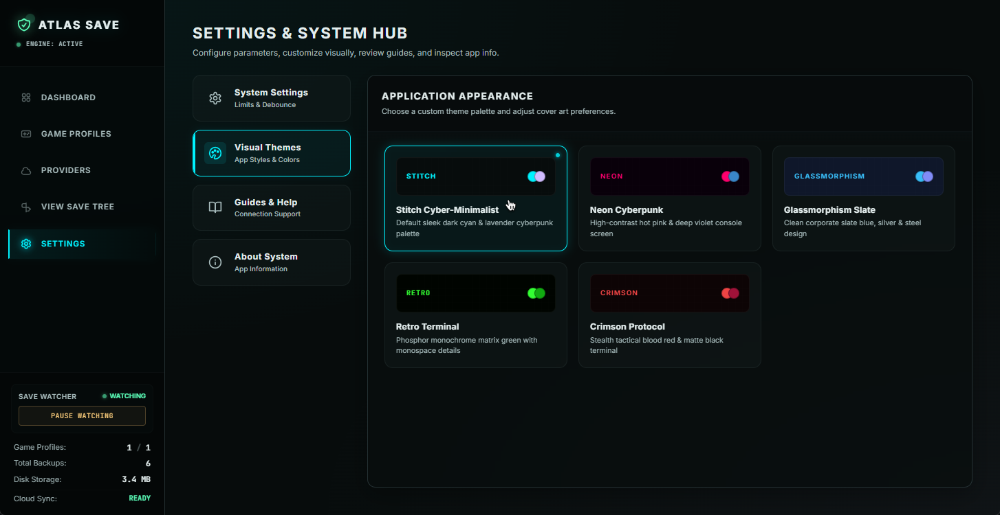

# 🛡️ AtlasSave — Git for Game Save Files 🎮

[](https://github.com/rayan-dev0/AtlasSave/releases)
[](https://github.com/rayan-dev0/AtlasSave/stargazers)
[](https://github.com/rayan-dev0/AtlasSave/blob/main/LICENSE)
[](https://github.com/rayan-dev0)
[](https://tauri.app)
[](https://react.dev)
[](https://www.rust-lang.org)

AtlasSave is a premium, automated, and lightweight desktop save game manager and synchronization tool built with **Tauri v2**, **React**, **TypeScript**, and **Rust**.

It watches your game save directories in real-time, compresses them into timestamped ZIP files, manages local restore points safely, and replicates backups to external folders (NAS) and private Git repositories (like GitHub) for seamless cloud syncing.

---

## 📸 Application Screenshots

### 🖥️ Main Dashboard



### 🌳 Save Version Explorer (Tree View)



### 🎮 Game Profiles



### 🐙 Backup Providers



### ⚙️ General Settings



### 🌗 Themes

## 

## 🚀 Key Features

- **Real-Time Active Watcher**: Uses Rust's native `notify` crate to detect save file modifications instantly, debouncing rapid file writes via an unbounded Tokio channel queue.
- **Safe Overwrite & Rollback Restore**: Before restoring a historical save, AtlasSave automatically moves active saves to a temporary folder. If decompression fails, it rolls back to protect against save corruption.
- **Game Subfolder Segregation**: Automatically structures Git repositories into game-specific subfolders (`git_repo/Elden_Ring/`) rather than throwing them into a flat root folder.
- **Automatic Bi-Directional Cloud Sync**: Periodically pulls commits, handles merge rebases automatically, and pulls remote ZIP archives down, making saves created on secondary devices (like a Steam Deck) immediately available in the restore list.
- **Advanced Git Sync Options**:
  - Custom interval-based pushes/pulls (Real-time, 5m, 15m, 30m, 60m, Manual).
  - Headless SSH key authentication overrides.
  - Automatic unknown host verification overrides (`StrictHostKeyChecking=accept-new`) to prevent background terminal prompt freezes.
  - Custom Git commit author identity mappings.
- **Diagnotics Console**: Features a persistent log feed streaming from `atlas_save.log` in AppData.

---

## 🛠️ Installation & Setup

### 1. Prerequisites

Ensure you have the following installed on your machine:

- [Node.js](https://nodejs.org/) (LTS recommended)
- [Rust & Cargo](https://www.rust-lang.org/tools/install)
- [Git CLI](https://git-scm.com/)

### 2. Development Mode

Clone this repository, install dependencies, and run the Tauri dev server:

```bash
# Install node dependencies
npm install

# Run the dev server (compiles Rust backend and hot-reloads Vite dev server)
npm run tauri dev
```

### 3. Production Compilation

To bundle the application into a standalone Windows executable:

```bash
npm run tauri build
```

This produces a production-ready installer/portable executable in `src-tauri/target/release/bundle/`.

---

## ⚙️ Backup Providers Configuration

AtlasSave supports two backup destinations, which can both be enabled simultaneously:

### 📂 Provider A: Local / Network Storage (NAS)

1. Navigate to the **Providers** page.
2. Toggle on the **Local / Network Backup (NAS)** switch.
3. Input or browse to your backup folder path (e.g. `D:\Backups\Saves` or a network drive path like `\\MyNAS\Backups`).
4. Save settings.

### 🐙 Provider B: Git Repository (GitHub / GitLab / self-hosted)

To sync your saves to a private Git repository, choose one of the following authentication routes:

#### Option 1: HTTPS Authentication (Personal Access Tokens - Recommended)

We recommend using **Fine-grained Personal Access Tokens** because they can be restricted to a single repository:

1. Create a **Private** repository on GitHub (you can name it anything you want, e.g. `game-saves`). Do _not_ make it public.
2. Go to your GitHub settings page &rarr; Developer Settings &rarr; **Personal Access Tokens** &rarr; **Fine-grained tokens**.
3. Generate a new token:
   - **Repository access**: Choose **Only select repositories** and select your saves repository.
   - **Repository permissions**: Under **Contents**, select **Read and Write** access.
4. Copy the generated token.
5. In AtlasSave:
   - **Interactive Method**: Choose **Split Fields**, set the protocol to **HTTPS**, fill in your repository details, and paste the token in the **Personal Access Token (PAT)** field.
   - **Raw URL Method**: Paste the formatted URL into the URL field:
     ```text
     https://oauth2:<your_token>@github.com/<your_username>/<your_repo_name>.git
     ```

> [!NOTE]
> If you prefer using classic Personal Access Tokens (account-scoped), you can generate a token under **Tokens (classic)** with the full **`repo`** scope and format the URL as `https://<your_username>:<your_token>@github.com/<your_username>/<your_repo_name>.git`.

#### Option 2: SSH Authentication (Key-based)

1. Set up an SSH keypair on your machine (e.g. `ssh-keygen -t ed25519 -C "atlassave"`).
2. Register the public key (`.pub`) either globally in your GitHub Profile settings under **SSH and GPG keys**, or as a **Deploy Key** on your specific saves repository (recommended for single-repo-scoped security):
   - Go to your saves repository settings on GitHub &rarr; **Deploy keys**.
   - Click **Add deploy key**, paste your public key, and check **Allow write access**.
3. Use your Git SSH URL format (replacing `game-saves.git` with your custom repository name):
   ```text
   git@github.com:<your_username>/<your_repo_name>.git
   ```
4. Paste this URL into AtlasSave.
5. Expand the **Advanced Git Settings** panel in AtlasSave:
   - Paste the absolute path to your private key file (e.g. `C:\Users\YourName\.ssh\id_ed25519`).
   - Toggle **Auto-Accept Host Keys** to **ON**. This appends `-o StrictHostKeyChecking=accept-new` to standard SSH commands, ensuring the app automatically verifies GitHub's server host keys in the background rather than hanging on terminal checks.
6. Save settings.

---

## 🎮 Usage Guide

### 1. Tracking a New Game

1. Go to the **Game Profiles** tab.
2. Click **Add New Game Profile**.
3. Type the Game Name.
4. **Auto-Detection**: Click **Browse Exe** to scan the game's executable path. AtlasSave will execute heuristic folder checks to automatically locate your local save folder (handling AppData, Saved Games, My Documents, etc.).
5. Alternatively, copy-paste or browse the path manually under **Manual Directory Path**.
6. Select one of the auto-resolved cover backdrops from Steam, GOG, or Epic Games Store databases to personalize the UI.
7. Click **Save Game Profile**.

### 2. Live Watcher Monitor

On the **Dashboard**, you can check the real-time activity of the watcher.

- **Toggle Watcher**: Pauses or resumes file system listening.
- **Manual Sync**: Click **Sync Cloud Now** to pull remote saves from other machines and push your latest local saves in one click.
- **Backup Now**: Instantly archives the selected game's saves.
- **Restore points**: Under the game details tab, click **Restore** on any archive row. Enter double-confirmation `YES` to overwrite active saves.

---

## 📈 Star History

[](https://star-history.com/#rayan-dev0/AtlasSave&Date)
